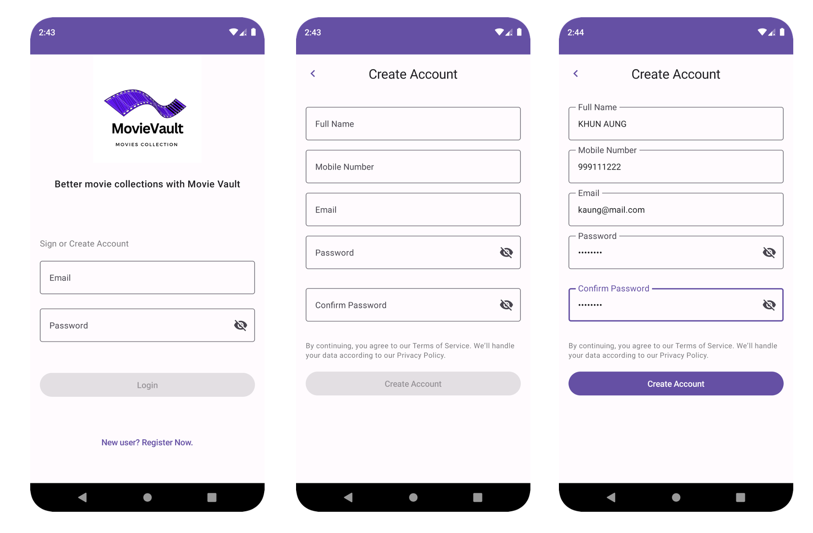
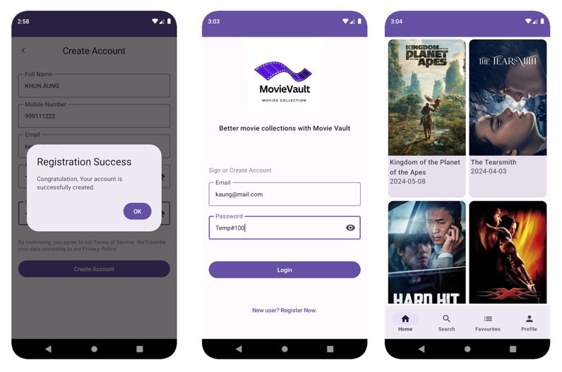
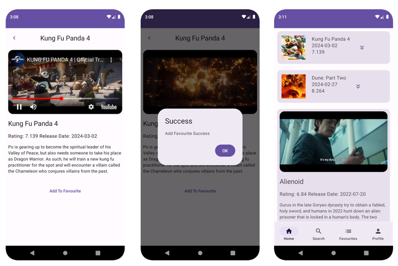
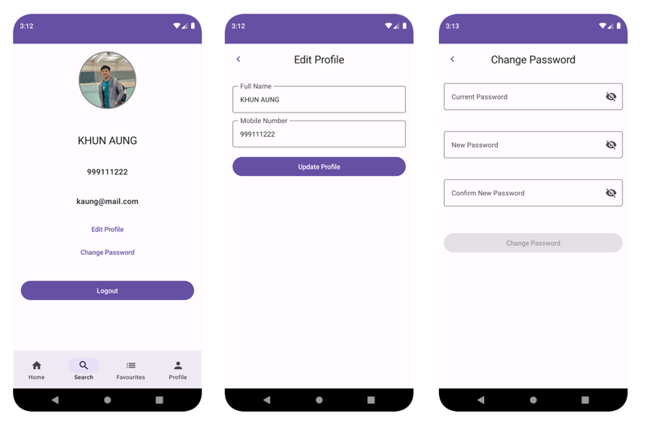

# **Movie-Vault (Movie Collection System)**

**Project Title:** Movie-Vault (Movie Collection System)

**Objective:** Design and develop a cutting-edge movie collection management system, harnessing the power of Azure Cloud Platform and Android technology to provide a seamless and intuitive user experience.

**Problem Statement:** Existing movie collection systems often suffer from:
* Disparate data storage and retrieval
* Clumsy user interfaces
* Limited scalability and security
* Inefficient data organization and retrieval

**Solution:** Create a comprehensive system that addresses these challenges by integrating:

Backend:
* Azure Cloud Platform for deployment
* Azure Blob storage for file storage
* Spring Boot for backend development
* Spring Security for user authentication
* Spring Data JPA for data persistence
* MySQL as the backend database

Frontend:
* Android mobile application
* Jetpack Compose for UI
* Retrofit for API integration
* Coroutine for asynchronous programming
* LiveData and MVVM for data management and architecture
* Kotlin programming language

**Goals:**
* Develop a robust and scalable movie collection system
* Ensure seamless integration and user-friendly interface
* Leverage Azure Cloud Platform and Azure Blob storage for efficient storage and retrieval
* Utilize Jetpack Compose and other frontend technologies for an intuitive and engaging user experience
* Prioritize security, scalability, and reliability in handling diverse user interactions

**Key Features:**
* User registration and login functionality
* Movie collection management and organization
* Movie trailer playback and favorites saving
* Intuitive search and filtering capabilities
* Personalized user recommendations
* Secure user data management and authentication

**Deliverables:**
* A fully functional movie collection management system
* A presentation showcasing the system's features and functionality

## Some features and UI Flow

### **Login & Create User Account**

### **Create User Account/ Login Success & Home Screen**

### **Seeing Movie Trailer & Add to Favourite**

### **Profile & Edit** 

